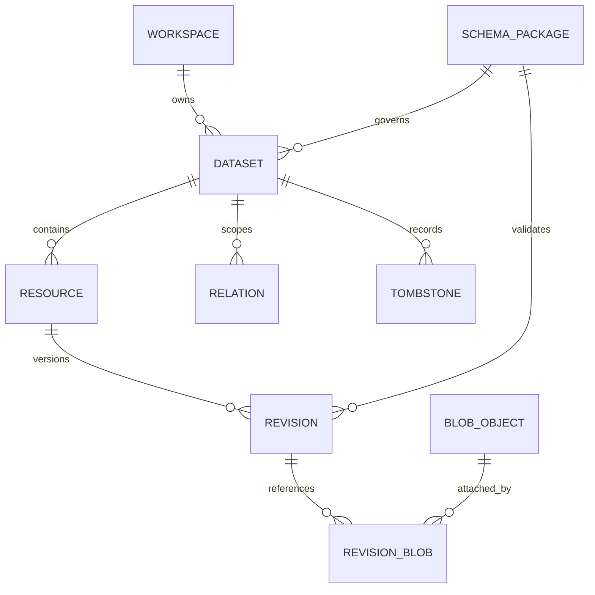
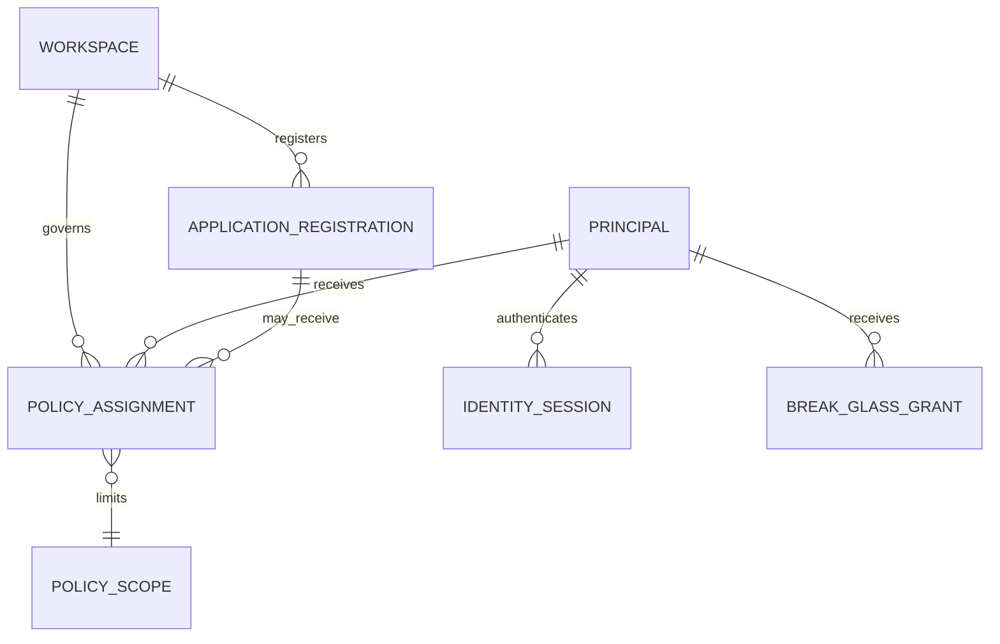
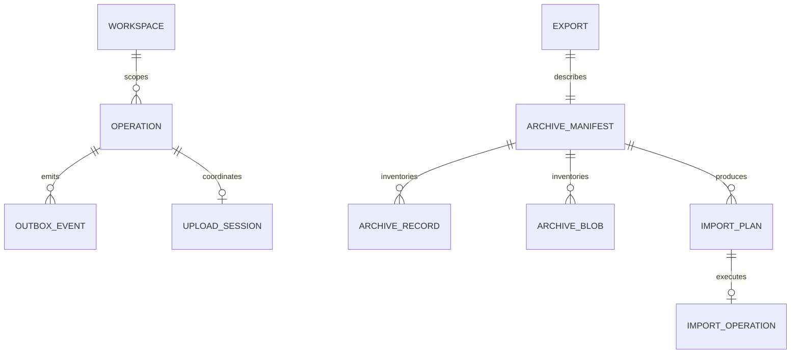
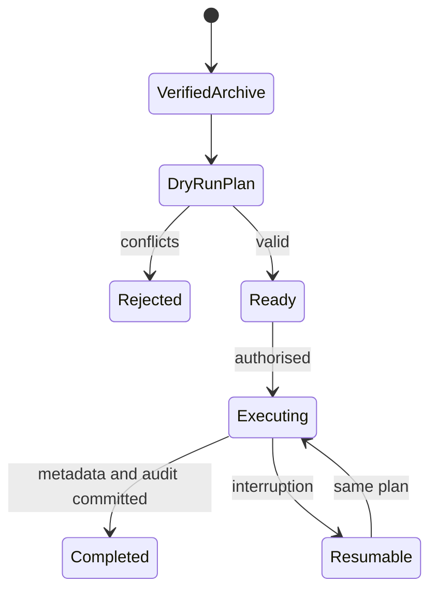

# Trust Core Logical Data Model

**Checkpoint:** 0.2E  
**Status:** provider-independent contract candidate  
**Applies to:** canonical Trust Core, policy, portability and derived-system boundaries

## Purpose

This model defines what Trust Core records mean independently of TypeScript,
HTTP, PostgreSQL, MinIO, ZIP64 or any future cloud provider. It is the common
contract against which those representations are checked.

It does not make probabilistic or derived data canonical. A future Large
Database Model consumes permissioned projections and remains outside this
model's authority.

## Model boundaries

| Classification | Authority                    | Examples                                                         | Rebuildable?                       |
| -------------- | ---------------------------- | ---------------------------------------------------------------- | ---------------------------------- |
| Canonical      | Trust Core                   | workspace, dataset, resource, revision, relation, tombstone      | No                                 |
| Evidence       | Trust Core                   | blob digest, audit event, verification run                       | No                                 |
| Operational    | Trust Core services          | operation, upload/import checkpoint, outbox event                | Only according to its lifecycle    |
| Security       | Identity and policy services | session, application registration, assignment, break-glass grant | No; revocation history is evidence |
| Portable       | `.trustarchive`              | manifest, exported canonical records, blob bytes, checksums      | Reconstructs canonical state       |
| Derived        | Adjacent systems             | embeddings, graphlets, predictions, model outputs                | Yes                                |

## Aggregate relationships

## Canonical entities

### Workspace

The top-level tenancy, policy and audit-chain boundary. A workspace owns
datasets, registrations, assignments, operations and evidence. Closing a
workspace does not erase its history.

Stable identity: `workspace.id`. Human names and slugs may change; IDs do not.

### SchemaPackage

An immutable, digest-pinned application schema identified by namespace, name
and semantic version. Schema packages may be referenced by many workspaces but
do not grant access to them. Imported schemas are data and are never executed.

Stable identity: the tuple `(namespace, name, version)` plus matching digest.

### Dataset

The portable ownership and retention boundary inside a workspace. Every
resource, relation and tombstone belongs to one dataset. A dataset selects a
schema package and may select a retention policy.

Stable identity: `dataset.id`, scoped by `workspace.id`.

### Resource

The stable application-visible subject. Mutable payload never lives on the
resource; `currentRevisionId` is a pointer to one immutable revision of the same
resource. Logical deletion changes lifecycle state and creates a tombstone.

Stable identity: `resource.id`, scoped by dataset and workspace.

### Revision

An immutable state of one resource. Revision number increases monotonically for
that resource. Parent and merge-parent links form an explicit acyclic history;
conflicts branch or fail rather than silently overwriting. Restore creates a new
revision and records its source revision.

Stable identity: `revision.id`; ordering identity: `(resource.id,
revisionNumber)`.

### BlobObject and RevisionBlob

`BlobObject` is workspace-scoped metadata for immutable bytes identified by
SHA-256 and byte length. It records the physical locator, encryption metadata
and verification state without making provider identity portable.
`RevisionBlob` gives the blob a role and optional logical name in one revision.

Portable content identity: `(sha256, byteLength)`. Database IDs, provider names,
keys and ETags are not portable content identity.

### Relation

An explicit namespaced edge among resources, revisions, blobs or controlled
external identifiers. It belongs to one workspace and dataset. Ending a
relation records `endedAt`; it does not rewrite the historic edge.

### Tombstone

Evidence of logical deletion, including actor, time, reason, recovery deadline,
prior revision and purge lifecycle. Restoration does not delete the tombstone;
it records restoration while appending a new revision.

### AuditEvent

Append-only, hash-chained evidence of a significant action. Actor types are
user, service, application or system. Request, correlation and operation IDs
connect decisions to durable work. Imported audit history must remain
distinguishable from target-native events while retaining source lineage.

### RetentionPolicy and LegalHold

Rules for recovery windows, minimum history, purge eligibility and holds.
References exist in the canonical and archive models, but a first-class
PostgreSQL retention-policy table and public contract are not implemented yet.
This is an explicit contract gap to close before production import execution.

## Identity and access entities

### Principal

A policy subject of type `user`, `service` or `application`. A principal ID is
meaningful only together with its type and identity authority. Identity-provider
claims may establish workspace roles, but persisted assignments remain explicit
records.

### ApplicationRegistration

A workspace-scoped registration identified by ID and unique namespace. It
declares schema packages and capabilities. Registration and capability are both
required before an application assignment can authorize an action.

### ApplicationTenant

An app-domain tenant identity under one `ApplicationRegistration` (for example
Foundation Tenant ID `1`). It is **not** a Trust Workspace. Stable identity is
`(workspaceId, applicationId, externalTenantKey)`. Display names may change;
external keys are immutable after create.

### StorageProfile and StorageBinding

Non-secret object-store metadata (`StorageProfile`) and a binding that attaches
that profile to an application default (`applicationTenantId` null) or a tenant
override. Effective resolution: tenant override → app default → platform host
storage. See ADR-016. Bytes remain content-addressed; catalog rows record sticky
`storage_binding_id` at commit.

### PolicyAssignment and PolicyScope

An append/revoke record connecting one typed principal to one role within one
workspace, dataset or application scope. Revocation sets `revokedAt`; it does
not erase the assignment. The scope ID must resolve inside the assignment's
workspace.

### IdentitySession

A short-lived authentication state. Only hashes of bearer session and CSRF
secrets are stored. Expiry, revocation and actor claims govern validity. A
session is not itself an authorization assignment.

### BreakGlassGrant

A time-limited, reasoned and auditable exception for an allow-listed recovery
action. It cannot grant arbitrary policy actions, cannot outlive expiry and is
revoked append-only. Every use creates audit evidence.

## Operational entities

### Operation and checkpoint

A workspace-scoped idempotent workflow. Identity is the tuple `(operationType,
workspaceId, idempotencyKey)`. State advances monotonically through a defined
machine. A completed operation returns its prior result when replayed with the
same request and rejects reuse with a different request.

### OutboxEvent

A transactionally emitted request for asynchronous work. Leasing, retries and
quarantine are operational state; the event remains connected to its operation
and workspace.

### UploadSession and ImportOperation

Specialized operation projections. Upload state coordinates temporary bytes,
hash verification, immutable commit, metadata and audit. Import state binds a
verified archive and deterministic plan to eight resumable checkpoints. No
partial import may be reported as successful.

### VerificationRun

Evidence that a blob, resource, dataset or workspace was checked at a stated
level and time. A passing historical run does not replace current verification.

## Portability model

An export captures a defined logical point and creates one manifest. The
manifest inventories record groups and content-addressed blobs. Checksums bind
all required entries. The container is transport only; ZIP paths and entry
ordering have no canonical domain meaning.

An import proceeds as:

`preserve_ids` retains portable identities. `mapped_workspace` creates a
deterministic identity map while preserving every internal reference. Neither
mode imports storage provider keys as canonical locators.

## Derived and Large Database Model boundary

Derived systems receive an authorised, versioned snapshot. They may create
embeddings, semantic relations, graphlets, anomaly scores or predictions, but
their outputs carry source lineage and model version and cannot mutate
canonical evidence directly. Destroying and rebuilding the derived system must
leave Trust Core unchanged.

A future Large Database Model is evaluated only after simpler SQL, graph,
embedding and statistical baselines exist. Its training corpus must be
permissioned and its output must remain reviewable derived evidence.

## Cross-representation mapping

| Logical entity          | Core/protocol representation            | Public API 0.1           | `.trustarchive`                    | PostgreSQL 0.1                 | Object storage                         |
| ----------------------- | --------------------------------------- | ------------------------ | ---------------------------------- | ------------------------------ | -------------------------------------- |
| Workspace               | `Workspace`                             | list                     | `workspaces.jsonl`, manifest scope | `workspaces`                   | workspace prefix only                  |
| SchemaPackage           | `PublishedSchemaPackage`                | list/get                 | `schema-packages.jsonl`            | `schema_packages`              | none                                   |
| Dataset                 | `Dataset`, `DatasetRecord`              | list/get                 | `datasets.jsonl`                   | `datasets`                     | none                                   |
| Resource                | `Resource`, `ResourceRecord`            | list/get                 | `resources.jsonl`                  | `resources`                    | none                                   |
| Revision                | `Revision`, `RevisionRecord`            | graph/create             | `revisions.jsonl`                  | `revisions`                    | none                                   |
| BlobObject              | `BlobObject` with encryption projection | ingest result indirectly | `blobs.jsonl` plus digest path     | `blob_objects`                 | immutable encrypted bytes by digest    |
| RevisionBlob            | persistence/fixture projection          | not directly exposed     | `revision-blobs.jsonl`             | `revision_blobs`               | none                                   |
| Relation                | `Relation`, `RelationRecord`            | list                     | `relations.jsonl`                  | `relations`                    | none                                   |
| Tombstone               | `Tombstone`, recoverable projection     | delete/restore/history   | `tombstones.jsonl`                 | `tombstones`                   | prevents premature byte purge          |
| AuditEvent              | `ChainedAuditEvent`, `AuditEventRecord` | list                     | `audit-events.jsonl`               | `audit_events`                 | none                                   |
| RetentionPolicy         | `RetentionPolicy`                       | list/get/create/update   | `retention.jsonl`                  | `retention_policies`           | governs later deletion                 |
| ApplicationRegistration | policy/protocol registration            | list/create              | not currently exported             | `application_registrations`    | no direct access                       |
| PolicyAssignment        | policy/protocol assignment              | evaluation only          | not currently exported             | `policy_assignments`           | no direct access                       |
| BreakGlassGrant         | policy/protocol grant                   | evaluation only          | must not activate implicitly       | `break_glass_grants`           | no direct access                       |
| IdentitySession         | identity provider session               | create/delete            | excluded                           | `identity_sessions`            | none                                   |
| Operation               | operation summary/state machine         | get                      | import operation is separate       | `operations`                   | coordinates temporary/canonical writes |
| UploadSession           | upload state                            | create/get/complete      | excluded                           | `upload_sessions`              | temporary upload then immutable blob   |
| ImportPlan              | archive package                         | create/get               | derived from verified archive      | `portability_import_plans`     | no bytes until execution               |
| ImportOperation         | archive execution port                  | execute/get              | references export and plan IDs     | `portability_import_operations` | operation-scoped staging               |
| VerificationRun         | verification package/protocol           | run/list/get             | evidence may be regenerated        | `verification_runs`            | reads and hashes bytes                 |

Security records are intentionally not part of ordinary dataset portability.
Workspace migration of registrations or assignments requires a distinct,
privileged security-policy export/import contract; archive presence alone must
never activate authority in the target.

## Known alignment findings

| Finding                                                                                    | Current state               | Required resolution                                                                                   |
| ------------------------------------------------------------------------------------------ | --------------------------- | ----------------------------------------------------------------------------------------------------- |
| Retention policy identity exists but has no first-class physical table or public API       | Resolved in 0.3 source      | Migration 0013 and public retention contracts preserve workspace scope and idempotency                 |
| Core `BlobObject` omits physical encryption fields present in PostgreSQL                   | Resolved in 0.3 source      | Core, persistence and archive projections expose state and opaque key reference without secrets        |
| Tombstone reason and restoration timestamp differed between domain and storage projections | Resolved in 0.2F source     | Core and PostgreSQL history projections now carry both fields                                         |
| Archive records are intentionally structurally open                                        | Accepted                    | Validate required identity/reference fields during planning while preserving unknown fields           |
| Identity sessions store actor claims as JSON rather than normalized principals             | Accepted for 0.1            | Treat sessions as authentication cache, never source-of-truth assignment data                         |
| Imported audit partition/linkage                                                           | Resolved in 0.2H            | Manifest binds source boundaries and the destructive Docker gate proved target-native linkage          |

The remaining accepted findings are intentional boundaries rather than missing
production mappings. Security-policy portability remains a separate privileged
contract and archive import never grants authority.
